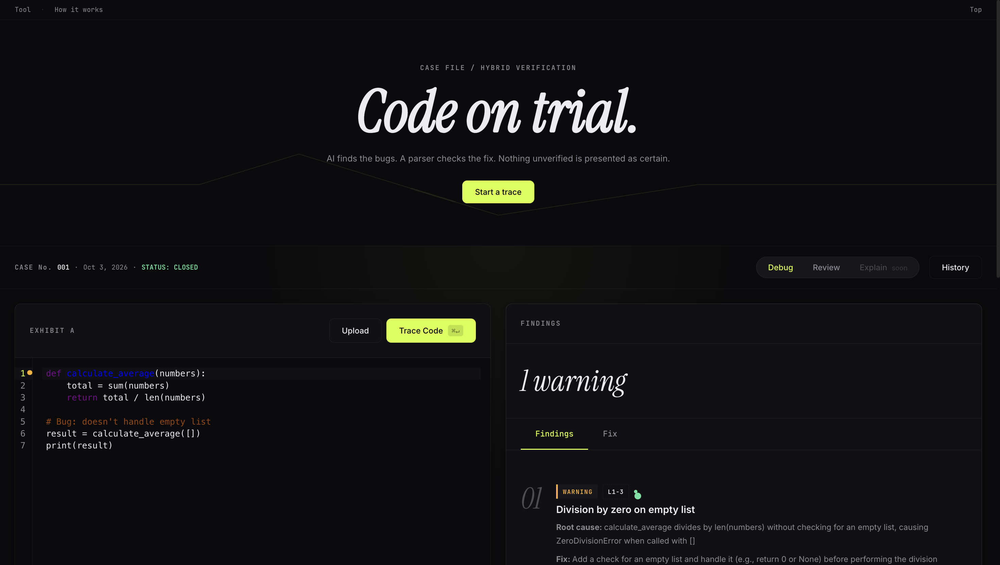

<div align="center">

# TRACER AI

### Code on trial.

An AI code debugger that **checks its own work.** The model finds the bugs, a real parser verifies what it can, and the interface labels what is *proven* and what is only *suggested*.


**[Open the live demo](https://tracer-ai-vhr1.onrender.com)**

<sub>Free hosting: the first load after idle can take about 50 seconds while the server wakes up.</sub>

</div>



---

## Contents

[Try it](#try-it-in-30-seconds) · [Why it exists](#why-it-exists) · [How it works](#how-it-works) · [Features](#features) · [API](#api) · [Project structure](#project-structure) · [Security](#security) · [Run locally](#run-locally) · [Deploy](#deploy-render) · [Limitations](#honest-limitations) · [Roadmap](#roadmap) · [What I learned](#what-i-learned)

---

## Try it in 30 seconds

1. Open the [live demo](https://tracer-ai-vhr1.onrender.com).
2. Load the **Python** example and press **Trace Code** (or `Cmd/Ctrl + Enter`).
3. Click a finding to jump to its lines in the editor, then open the **Fix** tab to see the diff.
4. Switch to **Review** mode for security, performance and best-practice notes.

## Why it exists

Most AI code tools answer everything in the same confident voice. TRACER treats the model's answer as a **claim to be checked**, and tells you how far the check went.

| Stamp | What it means |
|---|---|
| **Verified** | The fixed Python code was parsed successfully with `ast.parse`. |
| **Repaired** | The first fix failed to parse; one automatic repair attempt passed. |
| **AI suggestion** | Not machine-checked (a non-Python language, or verification failed). Review it yourself. |

> "Verified" means *valid syntax*, not *correct behaviour*. The interface says so.

## How it works

```
 your code
    |
    v
 [1 preflight]  size and empty checks, plus Python syntax facts (ast.parse)
    |
    v
 [2 LLM call]   JSON output, low temperature, code wrapped in delimiters
    |
    v
 [3 validate]   Pydantic schema; drop findings with impossible line numbers
    |
    v
 [4 verify]     Python: ast.parse(fixed_code); one repair attempt if it fails
    |
    v
 report: findings linked to editor lines, diff view, verification stamp
```

Design decisions worth knowing:

- **Parse-only verification.** Submitted code is never executed on the server. Running untrusted code would turn a debugging tool into a remote-code-execution risk, so verification stops at the parser.
- **One repair attempt, not a loop.** If the fix still fails to parse, it is returned and marked as unverified instead of retried forever.
- **Hallucination guard.** Any finding that points at a line outside the submitted code is dropped before it reaches the report.
- **Self-hosted editor bundle.** CodeMirror 6 is bundled once with esbuild and committed. Loading its many modules from a CDN caused duplicate-package errors and forced a weaker security policy; a single same-origin file fixed both.

## Features

- **Debug mode:** errors with root causes and a fixed version, shown as a diff with Copy and Download.
- **Review mode:** security, performance and best-practice notes, with no rewrite.
- **Findings linked to source:** click a finding to highlight its lines in the editor.
- **Six languages:** Python, JavaScript, Java, C, C++ and SQL, with one-click example snippets.
- **Designed states:** empty, loading, error, rate-limited and too-large screens, plus keyboard shortcuts.
- **Case-file design system:** Instrument Serif, Schibsted Grotesk and JetBrains Mono on a warm near-black palette; respects reduced-motion settings.

## API

`POST /api/analyze`

```json
{
  "code": "def avg(xs):\n    return sum(xs) / len(xs)",
  "language": "python",
  "mode": "debug"
}
```

| Field | Values |
|---|---|
| `language` | `auto`, `python`, `javascript`, `java`, `cpp`, `c`, `sql` |
| `mode` | `debug`, `review` |

A successful response includes `schema_version: 2`, `meta` (including a `verification` block), `findings` (each with severity, line range, title, root cause, fix hint and confidence) and `fixed_code`.

Errors return `{"success": false, "code": "...", "message": "..."}` with one of `EMPTY`, `TOO_LARGE`, `RATE_LIMITED`, `LLM_UNAVAILABLE` or `BAD_OUTPUT`. Raw exceptions are never returned.

`GET /health` returns service status, model and version.

## Project structure

```
TRACER_AI/
├── app.py                  # entry point: create_app() factory
├── tracer/
│   ├── config.py           # environment-driven settings, security headers
│   ├── api/routes.py       # /api/analyze, /health
│   ├── services/
│   │   ├── pipeline.py     # preflight -> LLM -> validate -> verify -> repair
│   │   ├── llm.py          # Groq client, timeouts, retries, error mapping
│   │   ├── verify.py       # deterministic checks (ast.parse)
│   │   └── schemas.py      # Pydantic request/response models
│   └── prompts/            # debug and review prompt templates
├── static/
│   ├── css/                # design tokens, base, components
│   ├── js/main.js          # editor, report, diff, state
│   └── vendor/             # prebuilt CodeMirror 6 bundle
├── templates/index.html
├── tools/                  # one-time esbuild script for the editor bundle
├── tests/unit/             # pytest suite
└── docs/                   # spec and notes
```

## Security

- The API key is read from the environment only; `.env` is gitignored.
- Submitted code is untrusted data: delimited in the prompt, output validated against a schema, never executed, never stored, and never written to logs (logs hold request IDs, sizes and timings).
- Model output is rendered with `textContent` only, never `innerHTML`.
- Strict Content-Security-Policy (`script-src 'self'`), security headers, per-IP rate limiting and a 15,000-character input cap.

## Run locally

```bash
git clone https://github.com/KAAVIYAASREE-VINU/TRACER_AI.git
cd TRACER_AI
python3 -m venv venv && source venv/bin/activate
pip install -r requirements.txt
cp .env.example .env          # then add your GROQ_API_KEY
python app.py                 # http://127.0.0.1:5000
```

| Variable | Required | Description |
|---|---|---|
| `GROQ_API_KEY` | Yes | Create one at https://console.groq.com/keys |

Run the tests:

```bash
python -m pytest tests/unit/ -v
```

Rebuild the editor bundle only when upgrading CodeMirror: `cd tools && npm install && npm run bundle`.

## Deploy (Render)

| Setting | Value |
|---|---|
| Build command | `pip install -r requirements.txt` |
| Start command | `gunicorn "app:create_app()" --worker-class gthread --workers 1 --threads 4 --timeout 60` |
| Environment | `GROQ_API_KEY`, `PYTHON_VERSION=3.12.3` |
| Health check path | `/health` |

More detail in [DEPLOY.md](DEPLOY.md).

## Honest limitations

- Only **Python** fixes are machine-checked, and only for **syntax**.
- The AI can be wrong. Treat every finding as a lead, not a verdict.
- The model occasionally returns invalid JSON, which shows as a temporary "AI unavailable" message. Trying again usually works.
- Language auto-detection is heuristic and can mislabel short snippets.
- **Explain mode** is not built yet (the button says "soon").
- No benchmark has been run yet, so **no accuracy numbers are claimed**.
- The demo is rate limited (10 requests per minute per IP) and sleeps when idle.

## Roadmap

- [ ] Beginner-friendly "what this code does" and "why this happens" explanations
- [ ] More reliable structured output from the model
- [ ] Explain mode
- [ ] A 30-case evaluation harness with published results
- [ ] Share links and Markdown export

## What I learned

- **Designing around model uncertainty:** verify what can be verified and label the rest, instead of presenting every answer with the same confidence.
- **Surviving provider changes:** the original Llama model moved to an enterprise tier, so the project moved to `gpt-oss-120b` with the same pipeline.
- **Debugging a real deploy:** Render defaulted to Python 3.14, which broke a dependency build until the version was pinned.
- **Security policy versus tooling:** a strict CSP rules out inline scripts and bare module imports, which is why the editor ships as a single self-hosted bundle.

---

<sub>Built by Kaaviyaa Sree Vinu · [GitHub](https://github.com/KAAVIYAASREE-VINU)</sub>
